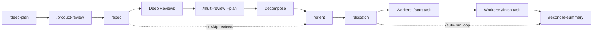

<p align="center">
  
</p>

<p align="center">
  <strong>Parallel agentic development framework for Claude Code</strong>
  <br>
  Turn Claude Code into an autonomous development team &mdash; multiple agents working
  simultaneously on isolated branches, coordinated by an orchestrator, with
  structured workflow that improves across sessions.
</p>

<p align="center">
  <a href="#quick-start">Quick Start</a> &middot;
  <a href="#why-claude-corps">Why?</a> &middot;
  <a href="#claude-code-skills-reference">Skills</a> &middot;
  <a href="#autonomous-multi-hour-orchestration">Auto-Run</a> &middot;
  <a href="#faq">FAQ</a>
</p>

<p align="center">
  <a href="https://github.com/josephneumann/claude-corps/blob/main/LICENSE"></a>
  <a href="https://github.com/josephneumann/claude-corps/stargazers"></a>
  <a href="https://github.com/josephneumann/claude-corps/commits/main"></a>
  
  
</p>

---

## Why claude-corps?

Claude Code is powerful on its own. claude-corps makes it a **team**.

- **Parallel execution** &mdash; Dispatch 3-5 Claude agents working simultaneously on different tasks, each in an isolated git worktree
- **Sequential execution** &mdash; Dependent tasks run one at a time on the branch via `--sequential` &mdash; no worktree overhead, no merge conflicts
- **Full lifecycle coverage** &mdash; From spec to dispatch to PR to code review, every step has a skill
- **Autonomous multi-hour runs** &mdash; `/auto-run` chains dispatch, reconcile, and repeat until your entire backlog is done
- **Human in the loop** &mdash; Agents execute, you decide. PRs are created, never auto-merged

---

## Quick Start

### Option A: Plugin Install

In Claude Code:
```
/plugin marketplace add josephneumann/claude-corps
/plugin install claude-corps@claude-corps
```

> **Note**: Plugin install namespaces skills as `/claude-corps:orient`, `/claude-corps:dispatch`, etc.
> For the full un-namespaced experience with CLAUDE.md integration, use Option B.

### Option B: Full Install (Recommended)

```bash
git clone https://github.com/josephneumann/claude-corps.git ~/Code/claude-corps
cd ~/Code/claude-corps && ./install.sh
```

This symlinks skills, agents, hooks, scripts, and docs into `~/.claude/` for un-namespaced `/orient`, `/dispatch`, etc.

Then in any project:

```bash
claude
> /orient              # Survey your project and identify parallel work
> /dispatch --count 3  # Spawn 3 workers in isolated worktrees
> /auto-run            # Or go fully autonomous
```

---

## The Workflow



| Phase | What happens |
|-------|-------------|
| **Plan** | `/deep-plan` orchestrates the full pipeline: `/product-review` challenges scope, `/spec` writes the plan, deep eng/design reviews add rigor, `/multi-review --plan` catches issues pre-coding, then decomposes to Linear. Or run each skill individually. |
| **Execute** | `/orient` surveys the project. `/dispatch` spawns workers &mdash; parallel (worktree-isolated, default) or sequential (`--sequential`, direct on branch). Each worker implements, tests, and writes a session summary. `/auto-run` does this in a loop until all tasks are done. |
| **Review** | `/multi-review` runs parallel specialized code review. `/reconcile-summary` syncs worker output with the task board. |

---

## Claude Code Skills Reference

All workflow capabilities are implemented as slash commands in `skills/`.

### Planning

| Skill | Purpose |
|-------|---------|
| `/deep-plan` | Full planning pipeline with checkpoints: product review, optional design exploration, spec, deep eng/design reviews, plan-stage multi-review, decomposition. Single entry point. |
| `/design-shotgun` | Generate 3-5 intentionally different UI directions before committing to a design approach |
| `/product-review` | Product-taste review with interrogation mode, assumption mapping, and devil's advocate challenges. EXPAND / HOLD / REDUCE / DESIGN modes |
| `/spec` | Research, plan, optionally decompose into Linear issues |
| `/spec --deepen` | Enhance an existing plan with parallel research |

### Execution

| Skill | Purpose |
|-------|---------|
| `/orient` | Survey project, identify parallel work streams |
| `/start-task <id>` | Claim task, create branch, gather context (requires Linear MCP for task tracking) |
| `/finish-task <id> [--direct]` | Tests, commit, PR, code review, browser verification, session summary, close. `--direct` skips PR/review for sequential tasks. |

### Orchestration

| Skill | Purpose |
|-------|---------|
| `/dispatch [--sequential]` | Spawn workers: parallel (worktree-isolated, default) or sequential (direct on branch) |
| `/auto-run [--sequential]` | Autonomous dispatch-reconcile loop. `--sequential` for dependent task chains. |
| `/reconcile-summary` | Sync worker output with task board (requires Linear MCP) |
| `/summarize-session <id>` | Mid-session progress checkpoint (read-only) |

### Quality

| Skill | Purpose |
|-------|---------|
| `/qa` | Acceptance-first validation for release readiness, regressions, and browser workflows |
| `/benchmark` | Run a repeatable command on current branch vs baseline and report measured performance deltas |
| `/multi-review` | Parallel code review with specialized agents. `--plan <path>` mode reviews plans pre-implementation. |
| `/milestone-review` | Iterative review-fix loop for accumulated branch changes |
| `/humanizer` | Remove AI writing patterns, add natural voice |
| `/verify` | Verification discipline — evidence before claims |
| `/debug` | Systematic debugging methodology |
| `/writing-skills` | Skill authoring guidance (structure, tone, persuasion) |

<details>
<summary><strong>Skill details</strong> (click to expand)</summary>

### Planning Skills

**`/deep-plan`** &mdash; Full planning pipeline that orchestrates all planning skills in sequence with user checkpoints between phases: product review (always), design exploration (opt-in), spec (always), deep engineering review (opt-out), deep design review (opt-out), plan-stage multi-review (opt-out), and Linear decomposition (opt-out). Supports `--yes` for autonomous operation, `--skip-reviews` to rely on spec's inline Phase 2.5, and `--no-decompose`. Use instead of manually chaining `/product-review`, `/spec`, and review skills.

**`/design-shotgun`** &mdash; Divergence before commitment for UI-heavy work. Generates 3-5 intentionally different design directions from a brief or plan, forcing real variation in hierarchy, interaction model, responsive posture, and differentiation. Ends with a recommended direction and a handoff block for `/product-review DESIGN` or `/plan-design-review`. Does not edit plans or write code.

**`/product-review`** &mdash; Product-taste review that challenges scope and approach before committing engineering effort. Interrogation mode provides recommended answers for every question (grill-me style). Includes status quo analysis, assumption mapping across Value/Usability/Viability/Feasibility with risk prioritization, devil's advocate challenges (steel-man opposition, kill criteria), and alternatives analysis. Four modes: EXPAND (dream big), HOLD (maximum rigor), REDUCE (strip to essentials), DESIGN (UX-first &mdash; user journeys, interaction patterns, responsive strategy). Run before `/spec` or standalone.

**`/spec`** &mdash; Interactive refinement (Phase 0) moves from a vague idea to clear requirements. Runs parallel research agents (repo-research-analyst, spec-flow-analyzer, and conditionally best-practices-researcher and framework-docs-researcher). Writes plan to `docs/plans/`, then optionally decomposes into Linear issues with parent-child hierarchy and blocking relations (requires Linear MCP).

**`/spec --deepen`** &mdash; Finds the most recent plan in `docs/plans/`, discovers and applies all available skills, runs parallel research agents per-section, launches all review agents, and merges findings back into the plan. Updates tasks accordingly.

### Execution Skills

**`/orient`** &mdash; Discovers project structure, reads CLAUDE.md/README/PROJECT_SPEC, analyzes task state, checks git health, outputs a structured orientation report with recommended parallel work streams. Always offers `/dispatch` as next action.

**`/dispatch`** &mdash; Identifies ready tasks, generates context, and spawns workers. Two modes: **parallel** (default) uses git worktree isolation for independent tasks, **sequential** (`--sequential`) executes tasks one at a time directly on the current branch for dependent tasks that need to see each other's changes. Supports `--count N`, `--sequential`, `--plan-first`, `--no-plan`, `--yes`, `--model`, and custom per-task context.

**`/start-task <id>`** &mdash; Validates the task, claims it, creates a task branch for isolation, gathers project context, optionally runs research agents, defines acceptance criteria, and begins implementation.

**`/finish-task <id> [--direct]`** &mdash; Runs quality gates (tests must pass), commits changes, pushes to remote. In default mode: creates a PR, runs `/multi-review` (skipped for milestone-branch PRs &mdash; review happens at milestone level), merges. With `--direct`: skips PR/review entirely (used by sequential dispatch). In both modes: closes the task and outputs a session summary. Merge conflicts in worktree mode trigger a fail-fast stop &mdash; no retry loops.

**`/reconcile-summary`** &mdash; Auto-discovers unreconciled summaries in `docs/session_summaries/`, cross-references summary claims against PR/CI evidence before trusting them, analyzes spec divergences, updates affected tasks in Linear (if connected), and closes obsoleted tasks. Discovered work from worker summaries is collected and proposed as a batch for user approval (batch-with-veto) &mdash; no issues are created without confirmation. Also updates the project description with current progress. Supports `--yes` for autonomous operation (auto-approves batch).

**`/summarize-session <id>`** &mdash; Read-only progress snapshot. Does not commit, push, or close anything.

### Quality Skills

**`/qa`** &mdash; Acceptance-first release validation. Gathers acceptance criteria from a task, plan, or diff; runs deterministic checks; infers regression surface; and, for UI-visible changes, follows the shared browser testing protocol. Produces a final verdict of Pass, Blocked, or Needs manual verification with evidence for every claim.

**`/benchmark`** &mdash; Measured performance workflow for repeatable commands. Runs the same command on the current branch and a baseline ref in a temporary worktree, captures multiple timed runs, reports median/min/max, and calls out variance so performance claims stay grounded in data.

**`/multi-review`** &mdash; Selects 3-5 review agents based on change types, runs them in parallel, aggregates findings by severity (Critical/Important/Informational), and resolves every finding through a resolution ledger: auto-fixes without prompting, drops false positives with reasons, defers genuine human decisions for adjudication. Includes workflow-based browser testing for frontend PRs (cache clearing, diff-driven workflow inference, interactive verification). Maximum 3 review cycles with exit conditions. **Plan mode** (`--plan <path>`): reviews an implementation plan pre-coding &mdash; keyword-scans the plan to select relevant reviewers (security, performance, architecture, etc.), prompts them to identify issues that would surface during code review, and resolves findings by amending the plan.

**`/milestone-review`** &mdash; Autonomous iterative review-fix loop for accumulated branch changes. Unlike `/multi-review` (interactive), milestone-review fixes all verified findings itself &mdash; refactoring, multi-file changes, pattern fixes &mdash; repeating until the branch is clean or max iterations are reached. Used automatically by `/auto-run` after tasks complete, or run standalone on any branch.

**`/humanizer`** &mdash; Writing editor that identifies and removes AI writing patterns (significance inflation, sycophantic tone, filler phrases, em dash overuse, etc.) to make text sound natural and human. Based on [Wikipedia's Signs of AI writing](https://en.wikipedia.org/wiki/Wikipedia:Signs_of_AI_writing). Outputs a draft rewrite, self-audit for remaining tells, and final revision.

### Discipline Skills

**`/verify`** &mdash; Centralized verification discipline cross-referenced by other skills. Contains the Iron Law (no claims without evidence), anti-rationalization table, red flags list, verification checklist, and anti-sycophancy guidance. Inspired by obra/superpowers.

**`/debug`** &mdash; Four-phase systematic debugging: reproduce, trace root cause, test hypotheses, minimal fix. Includes three-strikes rule (3 failed fixes = wrong assumptions). Adapted from obra/superpowers.

**`/writing-skills`** &mdash; Meta-skill for authoring effective skills. Covers CSO (description design), word count targets, anti-rationalization patterns, tone guidance from the humanizer, and persuasion principles. Informed by obra/superpowers.

</details>

---

## Autonomous Multi-Hour Orchestration

`/auto-run` enables fully autonomous operation. It dispatches workers, waits for completions, reconciles results, dispatches newly unblocked tasks, and repeats. Supports both parallel (worktree-isolated, default) and sequential (`--sequential`, direct on branch) modes. After all tasks complete, it runs a milestone review phase &mdash; an iterative review-fix loop on the accumulated branch changes (skip with `--skip-milestone-review`).

```bash
# All ready tasks (parallel)
/auto-run

# Sequential — for dependent task chains
/auto-run --sequential --through INT-14

# Everything needed to complete a specific task (resolves dependency graph)
/auto-run --through INT-14

# All tasks in a project
/auto-run --epic "Product Showcase Vignettes"

# Specific tasks plus their blockers
/auto-run --only INT-15 INT-16

# With limits
/auto-run --max-batches 3 --max-hours 4 --max-concurrent 5
```

### Unattended Mode (Wrapper Script)

For runs that outlast a single context window, the wrapper script provides process-level resilience:

```bash
~/.claude/scripts/auto-run.sh --max-hours 8
~/.claude/scripts/auto-run.sh --through INT-14 --max-hours 4
```

The wrapper uses `expect` to allocate a pty for interactive Claude sessions, sends `/auto-run --resume` into each fresh Claude session, and checks task state between iterations. State is checkpointed to `docs/auto-run-checkpoint.json` and survives restarts.

---

## Specialized Agents

Agent definitions in `agents/` are used by skills for research and review.

### Research Agents

Deployed by `/orient` and `/start-task` to gather context before implementation.

| Agent | Purpose |
|-------|---------|
| `repo-research-analyst` | Map architecture and conventions |
| `git-history-analyzer` | Historical context and contributors |
| `framework-docs-researcher` | Library docs and deprecation checks |
| `best-practices-researcher` | Industry patterns and recommendations |

### Code Review Agents

Deployed by `/multi-review` and `/milestone-review` for parallel specialized review.

| Agent | Focus |
|-------|-------|
| `code-simplicity-reviewer` | YAGNI, minimize complexity |
| `security-sentinel` | CWE-enriched OWASP review, business logic, absence detection |
| `performance-oracle` | N+1 queries, memory, caching |
| `pattern-recognition-specialist` | Anti-patterns, conventions |
| `architecture-strategist` | SOLID, design alignment |
| `agent-native-reviewer` | Action/context parity for agents |
| `api-security-reviewer` | Rate limiting, pagination, CORS, response filtering |
| `data-integrity-guardian` | Migration safety, ACID, GDPR/CCPA |
| `data-migration-expert` | Validates mappings against production |
| `nextjs-reviewer` | App Router, RSC, metadata, routing |
| `tailwind-reviewer` | Tailwind/shadcn, accessibility, responsive |
| `python-backend-reviewer` | FastAPI, SQLAlchemy, async, Alembic, pytest |
| `ux-reviewer` | Interaction flows, state completeness, form UX, cognitive load |
| `frontend-performance-reviewer` | Core Web Vitals, bundle size, rendering, waterfalls |

> **Note:** Framework-specific reviewers (`nextjs`, `tailwind`, `python-backend`, `api-security`, `ux`, `frontend-perf`) auto-detect from changed files. Use `reviewers.exclude` in `.claude/review.json` to suppress. See [Setting Up a New Project](#setting-up-a-new-project).

### Workflow Agents

| Agent | Purpose |
|-------|---------|
| `spec-flow-analyzer` | Analyze specs for dependencies, gaps, feasibility |

---

## Security

claude-corps uses a **layered security model** combining AI-driven review with deterministic CI/CD tooling for comprehensive coverage.

### AI Agent Layer (security-sentinel)

The `security-sentinel` agent focuses on what AI uniquely excels at:

- **Business logic vulnerabilities** &mdash; IDOR (CWE-639), authorization bypass (CWE-863), workflow manipulation, mass assignment (CWE-915)
- **Absence detection** &mdash; Missing rate limiting, CSRF protection, auth middleware, input validation, security headers, audit logging
- **Self-verification** &mdash; Every finding is tested against mitigating controls before reporting, reducing false positives
- **CWE-enriched output** &mdash; All findings include CWE numbers, confidence scores, exploit scenarios, and specific remediation
- **SAST triage** &mdash; When CI/CD produces SAST results, security-sentinel verifies each finding in context (confirm, dismiss, or escalate)

The `api-security-reviewer` agent covers API-specific gaps: rate limiting, pagination bounds, response data filtering, CORS, request size limits, and security logging.

### CI/CD Layer (deterministic tools)

A template workflow at [`docs/examples/security-checks.yml`](docs/examples/security-checks.yml) adds SAST and container scanning alongside your existing CI:

| Tool | Purpose |
|------|---------|
| Semgrep | Known vulnerability patterns (SQLi, XSS, path traversal) via SAST |
| Trivy | CVEs in container base images and OS packages |
| SARIF | Results uploaded to GitHub Security tab |

This complements (not replaces) existing CI checks like dependency audit (`pnpm audit`, `pip-audit`) and secret scanning (TruffleHog).

### Pre-Commit Layer

A secret scanning hook (`hooks/secret-scan-precommit.sh`) blocks commits containing credentials before they enter git history. Uses `gitleaks` if installed, falls back to regex pattern matching for AWS keys, GitHub tokens, private keys, and generic secrets.

### Recommended Configuration

For security-conscious projects, add `security-sentinel` as an always-on reviewer in `.claude/review.json`:

```json
{
  "reviewers": {
    "include": ["security-sentinel"]
  }
}
```

---

## How It All Fits Together

```
project-root/
├── CLAUDE.md                        # Project-specific config (you write this)
├── .claude/
│   ├── review.json                  # Optional: review config (tiers, reviewer overrides)
│   └── worktrees/                   # Worktrees for manual `claude --worktree` sessions
├── docs/
│   ├── session_summaries/           # Worker outputs (created by /finish-task)
│   │   └── reconciled/              # Processed by /reconcile-summary
│   ├── plans/                       # Output from /spec
│   ├── auto-run-checkpoint.json     # Auto-run state (survives restarts)
│   └── auto-run-logs/               # Wrapper iteration logs

~/.claude/                           # Global config (symlinked from this repo)
├── CLAUDE.md                        # Global workflow guidance
├── skills/                          # Slash commands
├── agents/                          # Specialized agent definitions
├── hooks/                           # Event hooks
├── scripts/                         # Wrapper scripts (auto-run.sh)
└── docs/                            # Global documentation
```

---

## Principles

1. **Parallel by default, sequential when needed** &mdash; Independent tasks run simultaneously in isolated git worktrees. Dependent tasks run sequentially on the branch (`--sequential`).
2. **Orchestrator + Workers** &mdash; One session coordinates, workers execute discrete tasks and report back.
3. **Task-sized work** &mdash; Big enough to be a meaningful atomic change, small enough to complete without exhausting context.
4. **Bounded autonomy** &mdash; Clarify requirements first, then execute autonomously within those bounds.
5. **Tests as the contract** &mdash; "Done" means tests pass. The code proves itself.
6. **Human in the loop** &mdash; Humans approve PRs, prioritize tasks, and make architectural decisions.
7. **Handoffs over context bloat** &mdash; Fresh context beats exhausted context.
8. **Session summaries** &mdash; Every completed task leaves breadcrumbs for the next session.
9. **Save what you learn** &mdash; Save debugging insights and non-obvious solutions to auto-memory when completing tasks.
10. **Codify the routine** &mdash; Repeated patterns become skills. If you do something twice, automate it.
11. **Evaluate, don't agree** &mdash; Verify claims against evidence before acting. No performative agreement.

---

## Workflow Examples

### Single-Session (with Linear)

```bash
/orient
/start-task INT-14
# implement...
/finish-task INT-14
```

### Multi-Agent Parallel (independent tasks)

```bash
/orient
/dispatch --count 3
# 3 workers spawn, each in an isolated worktree, working in parallel
# Workers run in the background and notify on completion
/reconcile-summary
```

### Sequential (dependent tasks, with Linear)

```bash
git checkout milestone/m4
/dispatch --sequential INT-14 INT-15 INT-16
# Tasks execute one at a time on the branch — each sees the previous task's commits
# No worktrees, no PRs per task. Review at milestone level.
```

### Fully Autonomous (requires Linear)

```bash
# Interactive (parallel)
/auto-run --through INT-14

# Interactive (sequential — for dependent chains)
/auto-run --sequential --through INT-14

# Unattended (hours-long, restarts across context exhaustions)
~/.claude/scripts/auto-run.sh --max-hours 8
```

### Full Planning Pipeline

```bash
# Single entry point — runs product review, spec, deep reviews, decomposition
/deep-plan "real-time price alerts for crypto"
/orient
/dispatch

# Autonomous (auto-answers all checkpoints)
/deep-plan "dashboard redesign" --yes

# Light mode (skip deep reviews, rely on spec's Phase 2.5)
/deep-plan "new feature" --skip-reviews

# Or manually chain individual planning skills
/product-review DESIGN    # map user journeys and interaction patterns first
/spec "dashboard redesign"
/multi-review --plan docs/plans/<plan>.md   # review plan before coding
/orient
/dispatch
```

---

## Setting Up a New Project

Global workflow config loads automatically from `~/.claude/CLAUDE.md`. Each project only needs its own `CLAUDE.md` for project-specific details:

```bash
cd /path/to/your/project
claude
> /orient                  # Start working
```

Your project `CLAUDE.md` should include: project summary, dev commands (`uv run pytest`, `pnpm dev`, etc.), critical rules, and architecture overview. Everything else comes from the global config.

Optionally, create a `.claude/review.json` to configure risk tiers and reviewer overrides. Framework-specific reviewers auto-detect from changed files — no config needed. See [`docs/examples/review-fullstack.json`](docs/examples/review-fullstack.json) for an example.

For security-conscious projects: add `"include": ["security-sentinel"]` to your review config for always-on security review, and copy [`docs/examples/security-checks.yml`](docs/examples/security-checks.yml) to `.github/workflows/` for CI/CD SAST and container scanning.

---

## Working Without Linear

All skills work without a task tracker. Here's what changes:

| Skill | Without Linear | With Linear |
|-------|---------------|-------------|
| `/deep-plan` | Full pipeline, skips decomposition phase | Full pipeline including Linear decomposition |
| `/spec` | Writes plan file to `docs/plans/` | Writes plan file + creates Linear issues with dependencies |
| `/orient` | Reads git state, plan files, code health | Reads git state + Linear project board with full task graph |
| `/dispatch` | N/A (run tasks manually from plan) | Spawns workers from ready issues, delegates via Linear |
| `/start-task` | N/A (start manually, no task tracking) | Claims issue, tracks status, gathers context from issue |
| `/finish-task` | Tests, commit, PR, session summary | Tests, commit, PR, session summary + closes Linear issue |
| `/auto-run` | N/A (manual workflow) | Autonomous dispatch-reconcile loop |
| `/multi-review` | Full parallel code review | Full parallel code review |
| `/product-review` | Full product review | Full product review |
| `/milestone-review` | Full iterative review-fix | Full iterative review-fix |

**Without Linear, the workflow is:**
```bash
/spec "your feature"          # Writes docs/plans/<plan>.md
# Read the plan, implement each section
/finish-task                  # Tests, commit, PR (skips task tracking)
```

**With Linear, the workflow is:**
```bash
/spec "your feature"          # Writes plan + creates Linear issues
/orient                       # Reads Linear board, identifies parallel streams
/dispatch --count 3           # Spawns 3 parallel workers from ready issues
/reconcile-summary            # Syncs worker results back to Linear
```

---

## FAQ

### How is this different from using Claude Code directly?

Claude Code runs as a single agent. claude-corps adds orchestration &mdash; multiple Claude sessions working in parallel on different tasks, each on isolated branches, coordinated by a team lead session that dispatches work and reconciles results.

### Can I run this unattended for hours?

Yes. `/auto-run` with the wrapper script (`~/.claude/scripts/auto-run.sh`) runs for hours, restarting Claude when context is exhausted. State is checkpointed and restored across restarts. PRs are created but never auto-merged &mdash; you review when ready.

### Do I need Linear?

No. Linear is optional. Without it, `/spec` writes plan files to `docs/plans/` and you execute from them directly. All planning, review, and quality skills work without any task tracker.

With [Linear MCP](https://mcp.linear.app/mcp) connected, skills automatically create issues, track status, manage dependencies, and coordinate parallel workers. Add it with:
```bash
claude mcp add --transport http linear-server https://mcp.linear.app/mcp
```

### Can I use this without any task tracker?

Yes. All skills degrade gracefully. `/spec` produces plan files. `/orient` surveys git state and code. `/multi-review` runs full review. `/finish-task` still does tests, commit, and PR. The orchestration skills (`/dispatch`, `/auto-run`) require Linear for task discovery, but you can always run tasks manually.

### What is the review config?

The review config (`.claude/review.json`) lets you configure per-project file sensitivity levels and reviewer overrides. It drives three behaviors: (1) `/multi-review` selects more reviewers for higher-risk files, (2) `/dispatch` uses plan-mode for critical/high-risk tasks, and (3) model selection routes critical/high tasks to Opus and medium/low to Sonnet. Framework-specific reviewers auto-detect from changed files — use `reviewers.exclude` to suppress false positives and `reviewers.include` to force always-on reviewers. Without a config file, skills fall back to keyword-based detection.

### How does smart model selection work?

`/dispatch` automatically selects Opus for critical/high-risk tasks and Sonnet for medium/low tasks. Use `--model opus` or `--model sonnet` to override. During `/multi-review`, critical-tier files get Opus for `security-sentinel` and `architecture-strategist` reviews.

### How does security review work?

claude-corps uses a layered model: the `security-sentinel` AI agent handles business logic vulnerabilities (IDOR, auth bypass, absence detection) that require understanding intent, while CI/CD tools handle deterministic checks (SAST via Semgrep, container scanning via Trivy, dependency audit, secret scanning). A pre-commit hook catches secrets before they enter git history. When SAST results are available, the AI agent triages them in context — confirming real vulnerabilities and dismissing false positives. See the [Security](#security) section for setup.

### Does this require Agent Teams?

No. claude-corps uses subagent worktrees (`isolation: "worktree"` on the Agent tool) for parallel execution and plain subagents (no isolation) for sequential execution. No Agent Teams configuration needed. All skills work with standard Claude Code.

### When should I use `--sequential` vs default parallel?

Use `--sequential` when tasks depend on each other (Phase 1 must complete before Phase 2 starts) or when tasks modify overlapping files. Use default parallel when tasks are independent. Sequential avoids merge conflicts and worktree overhead but runs one task at a time.

---

## How claude-corps Fits the Ecosystem

| Tool | What It Does | Relationship |
|------|-------------|--------------|
| [Claude Code](https://docs.anthropic.com/en/docs/claude-code) | Anthropic's agentic coding CLI | **Required** &mdash; claude-corps extends it |
| [Linear](https://linear.app) + [MCP](https://mcp.linear.app/mcp) | Task tracking and project management | **Optional** &mdash; skills use Linear MCP for task tracking when connected |
| [Claude Squad](https://github.com/smtg-ai/claude-squad) | Manage multiple terminal Claude agents | Alternative approach to multi-agent |
| [Aider](https://github.com/Aider-AI/aider) | AI pair programming in your terminal | Different paradigm (pair vs team) |

---

## Prerequisites

### Required

- **[Claude Code](https://docs.anthropic.com/en/docs/claude-code)** &mdash; Anthropic's CLI for Claude
- **git** &mdash; With worktree support (standard in modern git)
- **[gh](https://cli.github.com/)** &mdash; GitHub CLI for PR creation. Install: `brew install gh`

### For Task Tracking (Optional)

- **[Linear MCP](https://mcp.linear.app/mcp)** &mdash; Connects Linear project management to Claude Code for automatic issue creation, status tracking, and dependency management. Add with:
  ```bash
  claude mcp add --transport http linear-server https://mcp.linear.app/mcp
  ```
  Then run `/mcp` in Claude Code to authenticate via OAuth. Without Linear, all skills still work &mdash; you just manage tasks manually from plan files.

### For Frontend Browser Testing (Optional)

- **[Playwright MCP](https://github.com/microsoft/playwright-mcp)** &mdash; Browser automation for workflow verification. Install with `--isolated` for clean browser state on each session:
  ```bash
  claude mcp add playwright -- npx @playwright/mcp@latest --headless --isolated
  npx playwright install chromium
  ```
  The `--isolated` flag starts each session with an ephemeral in-memory profile, preventing stale cache/cookies from prior sessions. Without it, Playwright persists state to disk at `~/Library/Caches/ms-playwright/`.

  Used by `/finish-task`, `/multi-review`, and `/milestone-review` for workflow-based browser testing: cache clearing, diff-driven workflow inference, interactive testing (click, fill, type), persistence verification, and responsive checks. See `docs/browser-testing-protocol.md` for the full protocol.

### For Unattended Auto-Run

- **expect** &mdash; Allocates a pty for the wrapper script. Install: `brew install expect` (macOS) or `apt install expect` (Linux). Not needed if using `/auto-run` interactively.

---

## Installation

```bash
git clone https://github.com/josephneumann/claude-corps.git ~/Code/claude-corps
cd ~/Code/claude-corps && ./install.sh
source ~/.zshrc
```

The installer creates symlinks from `~/.claude/` to this repo. It's idempotent &mdash; safe to run multiple times. Existing directories are backed up.

Verify:
```bash
ls -la ~/.claude/skills ~/.claude/hooks ~/.claude/agents ~/.claude/scripts ~/.claude/docs
```

<details>
<summary><strong>Adding custom skills and hooks</strong></summary>

### Adding a Skill

Create `skills/my-skill/SKILL.md` with frontmatter:

```markdown
---
name: my-skill
description: "When to invoke this skill"
allowed-tools: Read, Bash, Glob, Grep
---

# My Skill: $ARGUMENTS

Instructions for Claude...
```

Commit and push &mdash; available as `/my-skill` in all projects.

### Adding a Hook

Create an executable script in `hooks/`:

```bash
vim ~/Code/claude-corps/hooks/my-hook.sh
chmod +x ~/Code/claude-corps/hooks/my-hook.sh
```

Register it in `~/.claude/settings.json` under the appropriate event.

</details>

---

## Inspiration

claude-corps' verification discipline, debugging methodology, and skill authoring guidance draw from [obra/superpowers](https://github.com/obra/superpowers) — Jesse Vincent's excellent single-agent skills framework. Specific techniques adapted:

- **Anti-rationalization tables** and **Iron Laws** for prompt-level compliance (verification-before-completion skill)
- **CSO (Claude Search Optimization)** for skill description design (writing-skills skill)
- **Systematic debugging methodology** (debug skill)
- **Persuasion-informed skill design** based on Cialdini principles (writing-skills skill)
- **Subagent distrust model** for processing agent reports (reconcile-summary skill)

Where superpowers optimizes a single agent session, claude-corps orchestrates many agents in parallel. The two frameworks are complementary — we borrowed their single-agent discipline to strengthen our multi-agent system.

---

## License

MIT
